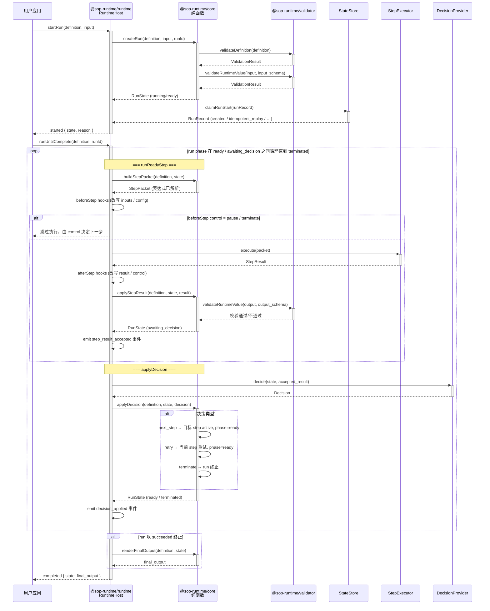

# sop-runtime

`sop-runtime` 是一个用 Bun 和 TypeScript 编写的 SOP 执行基础库。它把 SOP 拆成四层：DSL 定义、准入校验、纯状态机语义，以及可嵌入运行层。

这个仓库当前适合用来：

- 描述一份结构化 SOP definition。
- 在接收 definition 前执行 schema、semantic、expression 三类校验。
- 用 core 包创建 run、构建 step packet、应用 step result 和 supervision decision。
- 用 runtime 包把 core 状态机接到 store、executor、decision provider 等外部端口上。

## 快速开始

```sh
bun install
bun run check
```

`bun run check` 会依次执行 lint、typecheck 和测试。

## Workspace

- [`packages/definition`](./packages/definition/README.md)：共享 SOP DSL、运行时状态类型和表达式解析器。
- [`packages/validator`](./packages/validator/README.md)：SOP definition 的准入校验入口。
- `packages/core`：纯状态机语义，包括创建 run、生成 step packet、应用结果和渲染最终输出。
- [`packages/runtime`](./packages/runtime/README.md)：可嵌入运行层，组合 core 与外部端口。
- [`schemas/sop-definition.schema.json`](./schemas/sop-definition.schema.json)：SOP definition 的结构层 JSON Schema（仓库级公开工件，暂不作为 package export 发布）。
- [`examples/basic_sop_definition.json`](./examples/basic_sop_definition.json)：经过 validator 测试覆盖的参考定义（仓库级公开工件，暂不作为 package export 发布）。
- [`docs/design`](./docs/design)：设计文档。
- [`references/google_typescript_styleguide`](./references/google_typescript_styleguide)：本地 TypeScript 风格参考。

依赖方向保持单向：

```text
definition -> validator -> core -> runtime
```

## 运行时序图

以下时序图展示一次 SOP run 从启动到完成的完整调用链，说明四层包如何协作：



## 最小使用流程

1. 编写 SOP definition。有两种 authoring 方式：
   - JSON authoring：使用 [`examples/basic_sop_definition.json`](./examples/basic_sop_definition.json) 作为模板，结构可参考 [`schemas/sop-definition.schema.json`](./schemas/sop-definition.schema.json)。
   - TypeScript authoring：使用 `defineSop(...)` 获得类型约束的 authoring 辅助（来自 `@sop-runtime/definition`）。
2. 调用 `validateDefinition(definition)`，只接收 `ok === true` 的定义。两种 authoring 方式都必须经过 `validateDefinition`。
3. 通过 `host.registerExecutor(kind, name, handler)` 注册执行器处理函数，把 step packet 适配到本地命令、沙箱、工具或 agent。
4. 创建 `RuntimeHost`，传入 store 和可选 decision provider。
5. 调用 `startRun` 创建或复用 run，再调用 `runUntilComplete` 驱动到终止。

```ts
import {readFileSync} from 'node:fs';
import {validateDefinition} from '@sop-runtime/validator';
import {
  DefaultDecisionProvider,
  InMemoryStateStore,
  RuntimeHost,
} from '@sop-runtime/runtime';

const definition = JSON.parse(readFileSync('examples/basic_sop_definition.json', 'utf8'));
const validation = validateDefinition(definition);

if (!validation.ok) {
  throw new Error(JSON.stringify(validation.diagnostics, null, 2));
}

const host = new RuntimeHost({
  'store': new InMemoryStateStore(),
  'decisionProvider': new DefaultDecisionProvider(),
});

host.registerExecutor('tool', 'collect_context', async (input) => {
  return {
    'run_id': input.packet.run_id,
    'step_id': input.packet.step_id,
    'attempt': input.packet.attempt,
    'status': 'success',
    'output': {
      'summary': 'Collected context.',
      'next_action': 'Review and approve.',
    },
    'artifacts': {},
  };
});

const started = await host.startRun({
  definition,
  'input': {'ticket_id': 'ticket-001'},
});
const completed = await host.runUntilComplete({
  definition,
  'runId': started.state.run_id,
});

console.log(completed.state.status);
console.log(completed.final_output);
```

## 当前能做

- 定义 SOP 的身份、输入 schema、全局策略、步骤图、执行器配置、重试策略、监督 outcome 和最终输出模板。
- 通过 `defineSop` 获得 TypeScript 类型约束的 SOP authoring 辅助。
- 提供 SOP definition 的结构层 JSON Schema（位于 `schemas/sop-definition.schema.json`），便于编辑器提示和基础格式校验。
- 校验顶层结构、步骤引用、transition 和 outcome 的一致性。
- 校验模板表达式中的 `run.input.*`、`steps.<step_id>.output.*`、`steps.<step_id>.artifacts.*` 引用。
- 在单进程内用 `InMemoryStateStore` 跑通本地 demo 或测试。
- 通过 `RuntimeHost` 接入自定义 store、executor、decision provider、logger 和 event sink。
- 通过 runtime hooks 在 step 前后受控改写输入 / result，并请求 pause 或 terminate。

## 暂不包含

- Codex 插件、MCP server 或现成的 agent 集成。
- Definition registry、版本发布、审批流或远程 schema 分发。
- Schema/example 的 npm package export 或远程 URL 分发路径。
- 从自然语言自动生成 SOP definition 的 authoring 层。
- SQLite、file store、队列、租约或多 worker 调度实现。
- 独立 CLI 包。分支上出现 CLI 包时，可再使用 `bun run cli -- validate path/to/definition.json` 这类命令。

## 约定

- 使用 ES modules 和 named exports。
- 使用 `snake_case` 文件名。
- 按 package responsibility 组织代码。
- 测试文件放在对应包的 `src/` 目录下，文件名使用 `*.test.ts`。
