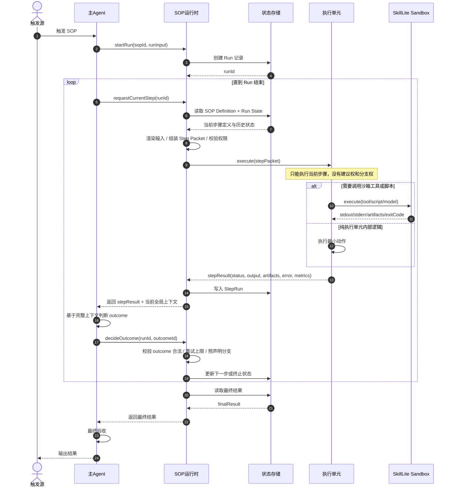

# SOP 自动化系统设计

> 创建时间：2026-04-16
> 最后更新：2026-04-16

---

## 定位

用 **SkillLite-sandbox** 做底层受控执行层，上层实现自己的 **SOP Orchestrator**。

该系统的核心前提是：

- **主 Agent** 是唯一的流程监管者
- **执行单元** 只做最小执行动作，不拥有建议权和流程决策权
- **所有分支、重试、终止路径** 都必须在 SOP 中预声明
- **运行时** 负责状态落盘、权限约束、审计日志和合法性校验

---

## 设计原则

1. **主 Agent 全流程监管**
   只有主 Agent 可以基于完整上下文决定下一步、是否重试、是否终止、是否进入降级路径。
2. **执行单元无建议权**
   执行单元只接收 `step packet`，只返回 `step result`。
3. **预声明分支**
   每个步骤允许进入的 outcome 和后继路径必须提前写入 SOP。运行时只接受预声明路径。
4. **最小上下文、最小权限**
   执行单元只能看到当前步骤需要的输入，只能使用当前步骤允许的工具和路径。
5. **运行时强校验**
   即便主 Agent 做判断，运行时仍然必须校验：分支是否合法、是否超出最大重试次数、是否命中并发/冷却限制。
6. **审计优先**
   每次 run、每次 step、每次 attempt 都要可追溯，便于排障、回放和成本核算。

---

## 架构分层

| 层级                        | 职责                                                     | 不负责                       |
| --------------------------- | -------------------------------------------------------- | ---------------------------- |
| **主 Agent**          | 触发 SOP、持有全局上下文、判定分支/重试/终止、做最终验收 | 不直接执行底层命令           |
| **SOP Runtime**       | 加载 SOP、渲染输入、分发步骤、落盘状态、校验合法性       | 不替主 Agent 做业务判断      |
| **状态存储**          | 保存 SOP 定义、Run、StepRun、Artifacts 索引、审计日志    | 不做调度                     |
| **执行单元**          | 执行单个最小动作并返回结构化结果                         | 不决定流程、不申请更多上下文 |
| **SkillLite Sandbox** | 在隔离环境中执行 tool/script/model 请求                  | 不持有 SOP 全局状态          |

---

## 核心对象

### 1. SOP Definition

静态流程蓝图，描述：

- 流程基本信息
- 输入 Schema
- 步骤定义
- 每步可用执行器
- 每步允许 outcome 及跳转关系
- 全局策略（冷却、并发、幂等、超时）

### 2. Run

某次 SOP 的具体执行实例，描述：

- `run_id`
- `sop_id`
- `run_input`
- 当前状态
- 当前步骤
- 开始/结束时间
- 最终输出

### 3. StepRun

某次 Run 中某一步的执行记录，描述：

- `step_id`
- `attempt`
- `executor_request`
- `executor_result`
- `supervisor_decision`
- 状态迁移结果

### 4. Step Packet

真正发给执行单元的最小上下文，通常只包含：

- 当前步骤元数据
- 当前步骤输入
- 当前步骤可用执行器配置
- 输出格式要求
- 运行时追踪字段

### 5. Step Result

执行单元返回的结构化结果，只包含执行事实，不包含流程建议。

---

## 引用表达式约定

SOP 中的 `inputs`、`path`、`final_output`、`idempotency_key_template` 等字段允许使用运行时表达式。

建议先只支持两类最小能力：

1. **直接引用**

   - `${run.input.company}`
   - `${steps.search_news.output.articles}`
   - `${steps.generate_report.artifacts.report_md}`
2. **空值兜底**

   - `${coalesce(steps.search_news.output.articles, steps.search_backup_source.output.articles, [])}`

这样可以覆盖大部分“读取上游结果”和“分支汇合”场景，同时避免一开始引入复杂表达式语言。

---

## 执行时序



---

## SOP Definition 完整示例

下面是一份可直接指导实现的数据结构示例。重点在于：

- 分支由主 Agent 决策
- 决策空间由 `supervision.allowed_outcomes` 约束
- 真正执行动作的单元只返回执行结果

```json
{
  "$schema": "https://example.com/schemas/sop-definition.schema.json",
  "sop_id": "company_news_report",
  "name": "公司新闻收集与摘要",
  "version": "1.0.0",
  "description": "收集指定公司的最新新闻并生成日报摘要。",
  "entry_step": "search_news",
  "input_schema": {
    "type": "object",
    "required": ["company", "report_date"],
    "properties": {
      "company": { "type": "string" },
      "report_date": { "type": "string", "format": "date" },
      "workspace": { "type": "string" }
    },
    "additionalProperties": false
  },
  "defaults": {
    "workspace": "/workspace/company-news"
  },
  "policies": {
    "cooldown_secs": 300,
    "max_run_secs": 1800,
    "idempotency_key_template": "company_news:${run.input.company}:${run.input.report_date}",
    "concurrency": {
      "mode": "singleflight",
      "key_template": "company_news:${run.input.company}:${run.input.report_date}"
    }
  },
  "steps": [
    {
      "id": "search_news",
      "title": "搜索新闻",
      "description": "搜索目标公司的相关新闻列表。",
      "inputs": {
        "company": "${run.input.company}",
        "report_date": "${run.input.report_date}"
      },
      "executor": {
        "kind": "sandbox_tool",
        "tool": "web_search",
        "command_template": "Search the latest news about {{company}} published on or before {{report_date}}.",
        "path": "${run.input.workspace}",
        "timeout_secs": 120,
        "allow_network": true,
        "env": {},
        "resource_limits": {
          "max_output_bytes": 1048576,
          "max_artifacts": 10
        }
      },
      "output_schema": {
        "type": "object",
        "required": ["articles"],
        "properties": {
          "articles": {
            "type": "array",
            "items": {
              "type": "object",
              "required": ["title", "url"],
              "properties": {
                "title": { "type": "string" },
                "url": { "type": "string" },
                "published_at": { "type": "string" }
              },
              "additionalProperties": false
            }
          }
        },
        "additionalProperties": false
      },
      "retry_policy": {
        "max_attempts": 2,
        "backoff_secs": [5, 20],
        "retry_on": ["timeout", "tool_error"]
      },
      "supervision": {
        "owner": "main_agent",
        "allowed_outcomes": [
          {
            "id": "continue",
            "description": "结果可用，进入下一步。"
          },
          {
            "id": "retry",
            "description": "本步骤可重试，重新执行当前步骤。"
          },
          {
            "id": "fallback_search",
            "description": "主搜索结果不足，进入降级搜索路径。"
          },
          {
            "id": "fail_run",
            "description": "终止本次 Run。"
          }
        ],
        "default_outcome": "fail_run"
      },
      "transitions": {
        "continue": {
          "next_step": "extract_news"
        },
        "retry": {
          "next_step": "search_news"
        },
        "fallback_search": {
          "next_step": "search_backup_source"
        },
        "fail_run": {
          "terminate": {
            "run_status": "failed",
            "reason": "search_news_failed"
          }
        }
      }
    },
    {
      "id": "search_backup_source",
      "title": "降级搜索",
      "description": "从备用来源补充新闻结果。",
      "inputs": {
        "company": "${run.input.company}"
      },
      "executor": {
        "kind": "sandbox_tool",
        "tool": "web_search",
        "command_template": "Search alternative sources for {{company}} news.",
        "path": "${run.input.workspace}",
        "timeout_secs": 120,
        "allow_network": true,
        "env": {},
        "resource_limits": {
          "max_output_bytes": 1048576,
          "max_artifacts": 10
        }
      },
      "output_schema": {
        "type": "object",
        "required": ["articles"],
        "properties": {
          "articles": {
            "type": "array",
            "items": {
              "type": "object",
              "required": ["title", "url"],
              "properties": {
                "title": { "type": "string" },
                "url": { "type": "string" }
              },
              "additionalProperties": false
            }
          }
        },
        "additionalProperties": false
      },
      "retry_policy": {
        "max_attempts": 1,
        "backoff_secs": [0],
        "retry_on": []
      },
      "supervision": {
        "owner": "main_agent",
        "allowed_outcomes": [
          {
            "id": "continue",
            "description": "进入抽取步骤。"
          },
          {
            "id": "fail_run",
            "description": "终止本次 Run。"
          }
        ],
        "default_outcome": "fail_run"
      },
      "transitions": {
        "continue": {
          "next_step": "extract_news"
        },
        "fail_run": {
          "terminate": {
            "run_status": "failed",
            "reason": "backup_search_failed"
          }
        }
      }
    },
    {
      "id": "extract_news",
      "title": "抽取结构化新闻",
      "description": "把搜索结果清洗成结构化数据。",
      "inputs": {
        "articles": "${coalesce(steps.search_news.output.articles, steps.search_backup_source.output.articles, [])}"
      },
      "executor": {
        "kind": "sandbox_model",
        "model": "small-model",
        "prompt_template": "Normalize and deduplicate the article list into structured records.",
        "path": "${run.input.workspace}",
        "timeout_secs": 180,
        "allow_network": false,
        "env": {},
        "resource_limits": {
          "max_output_bytes": 524288,
          "max_artifacts": 5
        }
      },
      "output_schema": {
        "type": "object",
        "required": ["records"],
        "properties": {
          "records": {
            "type": "array",
            "items": {
              "type": "object",
              "required": ["title", "url", "summary"],
              "properties": {
                "title": { "type": "string" },
                "url": { "type": "string" },
                "summary": { "type": "string" }
              },
              "additionalProperties": false
            }
          }
        },
        "additionalProperties": false
      },
      "retry_policy": {
        "max_attempts": 2,
        "backoff_secs": [3, 10],
        "retry_on": ["timeout", "invalid_output"]
      },
      "supervision": {
        "owner": "main_agent",
        "allowed_outcomes": [
          {
            "id": "continue",
            "description": "进入报告生成。"
          },
          {
            "id": "retry",
            "description": "重新执行抽取。"
          },
          {
            "id": "fail_run",
            "description": "终止本次 Run。"
          }
        ],
        "default_outcome": "fail_run"
      },
      "transitions": {
        "continue": {
          "next_step": "generate_report"
        },
        "retry": {
          "next_step": "extract_news"
        },
        "fail_run": {
          "terminate": {
            "run_status": "failed",
            "reason": "extract_news_failed"
          }
        }
      }
    },
    {
      "id": "generate_report",
      "title": "生成日报",
      "description": "根据结构化新闻数据生成最终摘要文件。",
      "inputs": {
        "company": "${run.input.company}",
        "records": "${steps.extract_news.output.records}"
      },
      "executor": {
        "kind": "sandbox_script",
        "tool": "terminal",
        "command_template": "python generate_report.py --company '{{company}}'",
        "path": "${run.input.workspace}",
        "timeout_secs": 120,
        "allow_network": false,
        "env": {},
        "resource_limits": {
          "max_output_bytes": 524288,
          "max_artifacts": 5
        }
      },
      "output_schema": {
        "type": "object",
        "required": ["summary"],
        "properties": {
          "summary": { "type": "string" }
        },
        "additionalProperties": false
      },
      "retry_policy": {
        "max_attempts": 1,
        "backoff_secs": [0],
        "retry_on": []
      },
      "supervision": {
        "owner": "main_agent",
        "allowed_outcomes": [
          {
            "id": "complete",
            "description": "流程完成。"
          },
          {
            "id": "fail_run",
            "description": "终止本次 Run。"
          }
        ],
        "default_outcome": "fail_run"
      },
      "transitions": {
        "complete": {
          "terminate": {
            "run_status": "succeeded",
            "reason": "report_ready"
          }
        },
        "fail_run": {
          "terminate": {
            "run_status": "failed",
            "reason": "generate_report_failed"
          }
        }
      }
    }
  ],
  "final_output": {
    "summary": "${steps.generate_report.output.summary}",
    "report_path": "${steps.generate_report.artifacts.report_md}"
  },
  "metadata": {
    "owner": "ops-team",
    "tags": ["news", "daily-report"]
  }
}
```

---

## Step Packet Schema

这是运行时发给执行单元的最小上下文。

```json
{
  "run_id": "run_20260416_0001",
  "step_id": "extract_news",
  "attempt": 1,
  "trace_id": "trace_abc123",
  "inputs": {
    "articles": []
  },
  "executor": {
    "kind": "sandbox_model",
    "model": "small-model",
    "prompt_template": "Normalize and deduplicate the article list into structured records.",
    "path": "/workspace/company-news",
    "timeout_secs": 180,
    "allow_network": false,
    "env": {},
    "resource_limits": {
      "max_output_bytes": 524288,
      "max_artifacts": 5
    }
  },
  "output_schema": {
    "type": "object",
    "required": ["records"],
    "properties": {
      "records": {
        "type": "array"
      }
    }
  },
  "artifacts_dir": "/tmp/sop-runs/run_20260416_0001/extract_news/1"
}
```

### Step Packet 约束

- 不包含完整 SOP 全文，除非当前步骤确实需要
- 不包含其他步骤的全部原始输出，只包含映射后的输入
- 不包含任何可以扩大权限的字段

---

## Step Result Schema

这是执行单元返回给运行时的结构化结果。

```json
{
  "run_id": "run_20260416_0001",
  "step_id": "extract_news",
  "attempt": 1,
  "status": "success",
  "output": {
    "records": [
      {
        "title": "Example title",
        "url": "https://example.com/news/1",
        "summary": "Example summary"
      }
    ]
  },
  "artifacts": {
    "normalized_json": "/tmp/sop-runs/run_20260416_0001/extract_news/1/normalized.json"
  },
  "error": null,
  "metrics": {
    "duration_ms": 1834,
    "exit_code": 0,
    "token_usage": {
      "input": 1200,
      "output": 320
    }
  }
}
```

### Step Result 约束

- 只允许返回 `status / output / artifacts / error / metrics`
- 输出必须满足当前步骤声明的 `output_schema`

---

## SOP Definition JSON Schema（草案）

下面这份 JSON Schema 用于校验 **SOP Definition** 本身。

```json
{
  "$schema": "https://json-schema.org/draft/2020-12/schema",
  "$id": "https://example.com/schemas/sop-definition.schema.json",
  "title": "SOP Definition",
  "type": "object",
  "additionalProperties": false,
  "required": [
    "sop_id",
    "name",
    "version",
    "entry_step",
    "input_schema",
    "policies",
    "steps",
    "final_output"
  ],
  "properties": {
    "sop_id": {
      "type": "string",
      "pattern": "^[A-Za-z0-9_-]+$"
    },
    "name": {
      "type": "string",
      "minLength": 1
    },
    "version": {
      "type": "string",
      "pattern": "^\\d+\\.\\d+\\.\\d+$"
    },
    "description": {
      "type": "string"
    },
    "entry_step": {
      "$ref": "#/$defs/stepId"
    },
    "input_schema": {
      "type": "object"
    },
    "defaults": {
      "type": "object"
    },
    "policies": {
      "$ref": "#/$defs/policies"
    },
    "steps": {
      "type": "array",
      "minItems": 1,
      "items": {
        "$ref": "#/$defs/step"
      }
    },
    "final_output": {
      "type": "object",
      "minProperties": 1
    },
    "metadata": {
      "type": "object"
    }
  },
  "$defs": {
    "stepId": {
      "type": "string",
      "pattern": "^[a-z][a-z0-9_]*$"
    },
    "policies": {
      "type": "object",
      "additionalProperties": false,
      "required": [
        "cooldown_secs",
        "max_run_secs",
        "concurrency",
        "idempotency_key_template"
      ],
      "properties": {
        "cooldown_secs": {
          "type": "integer",
          "minimum": 0
        },
        "max_run_secs": {
          "type": "integer",
          "minimum": 1
        },
        "idempotency_key_template": {
          "type": "string",
          "minLength": 1
        },
        "concurrency": {
          "type": "object",
          "additionalProperties": false,
          "required": ["mode", "key_template"],
          "properties": {
            "mode": {
              "type": "string",
              "enum": ["singleflight", "allow_parallel", "drop_if_running"]
            },
            "key_template": {
              "type": "string",
              "minLength": 1
            }
          }
        }
      }
    },
    "step": {
      "type": "object",
      "additionalProperties": false,
      "required": [
        "id",
        "title",
        "inputs",
        "executor",
        "output_schema",
        "retry_policy",
        "supervision",
        "transitions"
      ],
      "properties": {
        "id": {
          "$ref": "#/$defs/stepId"
        },
        "title": {
          "type": "string",
          "minLength": 1
        },
        "description": {
          "type": "string"
        },
        "inputs": {
          "type": "object"
        },
        "executor": {
          "$ref": "#/$defs/executor"
        },
        "output_schema": {
          "type": "object"
        },
        "retry_policy": {
          "$ref": "#/$defs/retryPolicy"
        },
        "supervision": {
          "$ref": "#/$defs/supervision"
        },
        "transitions": {
          "type": "object",
          "minProperties": 1,
          "additionalProperties": {
            "$ref": "#/$defs/transition"
          }
        }
      }
    },
    "executor": {
      "type": "object",
      "additionalProperties": false,
      "required": [
        "kind",
        "path",
        "timeout_secs",
        "allow_network",
        "env",
        "resource_limits"
      ],
      "properties": {
        "kind": {
          "type": "string",
          "enum": ["sandbox_tool", "sandbox_script", "sandbox_model"]
        },
        "tool": {
          "type": "string"
        },
        "model": {
          "type": "string"
        },
        "command_template": {
          "type": "string"
        },
        "prompt_template": {
          "type": "string"
        },
        "path": {
          "type": "string",
          "minLength": 1
        },
        "timeout_secs": {
          "type": "integer",
          "minimum": 1
        },
        "allow_network": {
          "type": "boolean"
        },
        "env": {
          "type": "object",
          "additionalProperties": {
            "type": "string"
          }
        },
        "resource_limits": {
          "$ref": "#/$defs/resourceLimits"
        }
      },
      "allOf": [
        {
          "if": {
            "properties": {
              "kind": {
                "const": "sandbox_tool"
              }
            }
          },
          "then": {
            "required": ["tool", "command_template"]
          }
        },
        {
          "if": {
            "properties": {
              "kind": {
                "const": "sandbox_script"
              }
            }
          },
          "then": {
            "required": ["tool", "command_template"]
          }
        },
        {
          "if": {
            "properties": {
              "kind": {
                "const": "sandbox_model"
              }
            }
          },
          "then": {
            "required": ["model", "prompt_template"]
          }
        }
      ]
    },
    "resourceLimits": {
      "type": "object",
      "additionalProperties": false,
      "required": ["max_output_bytes", "max_artifacts"],
      "properties": {
        "max_output_bytes": {
          "type": "integer",
          "minimum": 1
        },
        "max_artifacts": {
          "type": "integer",
          "minimum": 0
        }
      }
    },
    "retryPolicy": {
      "type": "object",
      "additionalProperties": false,
      "required": ["max_attempts", "backoff_secs", "retry_on"],
      "properties": {
        "max_attempts": {
          "type": "integer",
          "minimum": 1
        },
        "backoff_secs": {
          "type": "array",
          "items": {
            "type": "integer",
            "minimum": 0
          }
        },
        "retry_on": {
          "type": "array",
          "items": {
            "type": "string",
            "enum": ["timeout", "tool_error", "invalid_output", "sandbox_error"]
          }
        }
      }
    },
    "supervision": {
      "type": "object",
      "additionalProperties": false,
      "required": ["owner", "allowed_outcomes", "default_outcome"],
      "properties": {
        "owner": {
          "type": "string",
          "const": "main_agent"
        },
        "allowed_outcomes": {
          "type": "array",
          "minItems": 1,
          "items": {
            "$ref": "#/$defs/outcome"
          }
        },
        "default_outcome": {
          "type": "string",
          "minLength": 1
        }
      }
    },
    "outcome": {
      "type": "object",
      "additionalProperties": false,
      "required": ["id", "description"],
      "properties": {
        "id": {
          "type": "string",
          "pattern": "^[a-z][a-z0-9_]*$"
        },
        "description": {
          "type": "string",
          "minLength": 1
        }
      }
    },
    "transition": {
      "oneOf": [
        {
          "type": "object",
          "additionalProperties": false,
          "required": ["next_step"],
          "properties": {
            "next_step": {
              "$ref": "#/$defs/stepId"
            }
          }
        },
        {
          "type": "object",
          "additionalProperties": false,
          "required": ["terminate"],
          "properties": {
            "terminate": {
              "$ref": "#/$defs/terminalState"
            }
          }
        }
      ]
    },
    "terminalState": {
      "type": "object",
      "additionalProperties": false,
      "required": ["run_status", "reason"],
      "properties": {
        "run_status": {
          "type": "string",
          "enum": ["succeeded", "failed", "cancelled"]
        },
        "reason": {
          "type": "string",
          "minLength": 1
        }
      }
    }
  }
}
```

---

## 运行时额外校验

JSON Schema 只能做静态校验，运行时还需要补这些约束：

1. `entry_step` 必须存在于 `steps[].id`
2. 所有 `step.id` 必须唯一
3. 每个 `transitions` 的 key 必须存在于 `supervision.allowed_outcomes`
4. `supervision.allowed_outcomes` 中的每个 `id` 都必须在 `transitions` 中有对应定义
5. 所有 `next_step` 必须指向已存在的步骤
6. 若 outcome 代表重试，运行时必须校验 `attempt < retry_policy.max_attempts`
7. 执行单元返回的 `output` 必须满足当前步骤的 `output_schema`
8. 执行单元不得返回未声明字段
9. `final_output` 中引用的步骤输出必须真实存在

---

## 落地建议

如果按这版实现，最先做的应该是：

1. 先实现 **SOP Definition 校验器**
2. 再实现 **Run / StepRun 状态模型**
3. 再实现 **Step Packet 渲染器**
4. 再接 **SkillLite-sandbox 执行适配层**
5. 最后实现 **主 Agent 决策环**

这样实现路径最稳，也最容易逐步验证。
